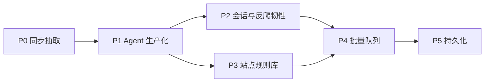

# arachne 设计文档

> 版本：v0.3.0 · 受众：维护者与调用方（AI Agent 系统）  
> 仓库：https://github.com/Ever12349/arachne  
> 状态：P2 已落地（加密会话引用、防御性反爬、可选 Playwright `render`）。默认镜像仍不含浏览器。无站点规则 / 队列 / DB。

## 1. 定位

arachne 是一个 **Python HTTP 爬虫/抽取服务**：接收 URL（及后续可选的会话与策略参数），返回 **结构化、对 LLM/Agent 友好的 JSON**，而不是原始 HTML dump。

**主调用方**：AI Agent 系统（工具调用 / Function calling）。设计优先保证：

- 契约稳定、字段语义清晰
- 错误可机读（`error.code`）
- 延迟与体量可控（超时、响应上限、链接封顶、QPS/并发、缓存）
- 可在 Agent 工作流里同步调用（P0–P2），后续支持异步任务（批量队列）

**非定位**：通用浏览器自动化 IDE、恶意爬虫框架、认证攻击工具。

## 2. 目标与边界

### 2.1 要做的事

| 能力 | 说明 |
|------|------|
| URL → 结构化页 | title、main_text、metadata、links、truncated |
| 稳定 HTTP API | FastAPI，供 Agent 工具层调用 |
| 生产可用性（P1） | POST 会话注入、速率/并发、TTL 缓存、`max_chars`、`/stats` |
| 登录态与反爬韧性（P2） | 加密 `session_id`、超时/连接重试、UA 策略、挑战页识别、可选 `render` |
| 可演进 | 站点规则、批量、持久化按路线图推进 |

### 2.2 安全与合规边界（硬约束）

- **不做**凭证窃取、撞库、验证码农场、漏洞利用类「认证绕过」
- **登录态**：仅支持调用方显式注入其有权使用的 Cookie / Authorization（POST `cookies` / `headers`），或引用事先写入磁盘的 **Fernet 加密会话文件**（`session_id`）。服务端不代为破解登录墙，也没有会话管理 HTTP API
- **robots / 站点条款**：实现阶段遵守可配置策略；默认尊重合理速率与体积极限
- 不把 Cookie / Authorization / cookies / 会话明文写入日志（会话指纹 sha256 前缀可以）

「以后需要的规则库 / 队列 / 存储」见 §6 路线图；其中原「认证绕过」诉求落地为 **受控会话注入 + 合法授权访问**，不实现攻击型绕过。

## 3. API 契约（面向 Agent）

契约版本 **0.3.0**。

### 3.1 端点（P2）

| 方法 | 路径 | 作用 |
|------|------|------|
| `GET` | `/health` | 探活（**免** QPS 与抽取并发） |
| `GET` | `/stats` | 进程内计数器（**免** QPS 与抽取并发） |
| `GET` | `/extract?url=&max_chars=` | 同步抽取；可选 `max_chars`。**无** cookies/headers/`session_id`/`ua_strategy`/`render` |
| `POST` | `/extract` | 同步抽取；见下表 JSON 字段 |

POST `/extract` JSON：

| 字段 | 类型 | 默认 | 说明 |
|------|------|------|------|
| `url` | string | 必填 | http(s) URL |
| `headers` | `dict[str,str]` | 省略 | 允许名单请求头；覆盖会话头 |
| `cookies` | `dict[str,str]` | 省略 | 上游 Cookie；覆盖会话 Cookie。Cookie **不能**走 headers |
| `max_chars` | int | 省略 | `main_text` 截断 |
| `session_id` | string | 省略 | 引用 `ARACHNE_SESSIONS_DIR/{id}.bin` |
| `ua_strategy` | `"default"` \| `"rotate"` | `"default"` | `rotate` 使用内置小型 UA 池；调用方/会话里的 `User-Agent` 仍优先 |
| `render` | bool | `false` | `true` 时用 Playwright 取 HTML；未安装 → `render_unavailable` |

后续（见路线图）可增加例如：

- `POST /jobs` / `GET /jobs/{id}` — 批量与异步
- `POST /extract` 扩展字段：`site_profile` 等

GET 会话、成功响应上的 `cached` 字段、错误结果缓存：**不做**。

### 3.2 成功响应

`links` 使用对象列表。`url` 为重定向后的最终地址；`requested_url` 为调用方原始 URL。metadata 字符串字段缺省为 `""`。`truncated` 默认 `false`：仅在 `main_text` 因 `max_chars` 或硬上限被截断时为 `true`。成功体 **没有** `cached` 字段；命中只计入日志与 `/stats`。

```json
{
  "url": "https://example.com/final",
  "requested_url": "https://example.com",
  "status_code": 200,
  "title": "Example Domain",
  "main_text": "…可读正文…",
  "metadata": {
    "description": "…",
    "language": "en",
    "content_type": "text/html; charset=utf-8",
    "og": {
      "title": "…",
      "description": "…",
      "image": "…"
    }
  },
  "links": [
    {"href": "https://example.com/a", "text": "A"}
  ],
  "truncated": false
}
```

正文由 trafilatura 从已下载（或已渲染）HTML 抽取；若 `title` 与 `main_text` 均为空 → `extract_empty`。

`max_chars` / 硬上限（在缓存写入**之后**应用）：

- 省略 `max_chars`：只应用 `MAIN_TEXT_MAX_CHARS=100_000`；若被硬截断则 `truncated=true`
- 提供 `max_chars`：先夹到 `[1, MAIN_TEXT_MAX_CHARS]`，再截断；发生截断则 `truncated=true`

链接：全页 lxml `<a>`；跳过空 href、裸 `#` fragment、`javascript:` / `mailto:` / `tel:`、非 `http(s)`；锚文本上限 `LINK_TEXT_MAX_CHARS=200`；最多 50 条；同 host 优先（比较 host 时去掉前导 `www.`）。

### 3.3 错误响应（机读）

HTTP 状态与业务码分离；body 统一：

```json
{
  "error": {
    "code": "bad_url | session_invalid | challenge_detected | fetch_failed | timeout | unsupported_content | too_large | unauthorized_upstream | extract_empty | rate_limited | render_unavailable | render_failed | internal",
    "message": "人类可读短句",
    "detail": {}
  }
}
```

错误码 → HTTP：

| code | HTTP |
|------|------|
| `bad_url` | 400 |
| `session_invalid` | 400 |
| `challenge_detected` | 403 |
| `unsupported_content` / `extract_empty` / `too_large` | 422 |
| `rate_limited` | 429 |
| `timeout` | 504 |
| `fetch_failed` / `unauthorized_upstream` / `render_failed` | 502 |
| `render_unavailable` | 501 |
| `internal` | 500 |

上游 `status >= 400` **不抽取**（挑战页除外，见 §3.7）：401/403 → `unauthorized_upstream`，其余 → `fetch_failed`；`detail` 含 `status_code`。

Agent 应根据 `error.code` 分支（重试 / 换 `ua_strategy` 或 `render` / 向用户要 Cookie），而不是解析 `message` 字符串。

### 3.4 会话注入与加密会话（仅 POST）

**请求体注入（P1，仍有效）**

- `cookies`：`dict[str, str]` → 上游请求 cookies
- `headers`：仅允许 `Authorization`、`Accept`、`Accept-Language`、`User-Agent`、`Referer`、`Cache-Control`（大小写不敏感，转发时用规范名）
- 拒绝/剥离：`Host`、`Content-Length`、`Transfer-Encoding`、`Connection`、`Cookie`（Cookie **只能**走 `cookies` 字段或会话文件的 `cookies`）
- 调用方 `User-Agent` 覆盖默认 `ARACHNE_USER_AGENT`，也覆盖 `ua_strategy=rotate`
- GET `/extract` 不接受 cookies/headers/`session_id`

**加密会话引用（P2）**

- 可选 `session_id`，必须匹配 `^[A-Za-z0-9_-]{1,64}$`
- 文件：`{ARACHNE_SESSIONS_DIR}/{id}.bin`（默认目录 `./data/sessions`）
- 明文 JSON：`{"cookies": {…}, "headers": {…}}`，Fernet 加密；密钥 `ARACHNE_SESSION_KEY`
- 合并顺序：会话 cookies/headers 为底，请求体覆盖，再走现有 header 允许名单
- 缺密钥 / id 非法 / 解密失败 / 文件不存在 → `session_invalid`（HTTP 400）。错误信息不区分原因，避免侧信道
- **没有**会话增删改 HTTP API。用 `scripts/write_session.py` 离线写入
- 日志禁止 Cookie / Authorization / 会话明文

生成密钥并写入会话：

```bash
python -c "from cryptography.fernet import Fernet; print(Fernet.generate_key().decode())"
export ARACHNE_SESSION_KEY='…'
export ARACHNE_SESSIONS_DIR=./data/sessions
python scripts/write_session.py --id demo \
  --cookies '{"sid":"abc"}' \
  --headers '{"Authorization":"Bearer …"}'
```

### 3.5 `/stats`

```json
{
  "requests_total": 0,
  "errors_by_code": {},
  "cache_hits": 0,
  "cache_misses": 0,
  "in_flight": 0,
  "latency_ms_sum": 0.0,
  "latency_ms_count": 0
}
```

计数只覆盖抽取流水线（含 `rate_limited` / `session_invalid` 等）。`/health` 与 `/stats` 自身不计入。

### 3.6 调用约定（给 Agent 集成）

- 需要会话、UA 策略或 `render` 时必须 `POST /extract`；GET 只有 `url` + 可选 `max_chars`
- 设置客户端超时略大于服务端读超时 / 渲染超时（建议服务端 15s，Agent 侧 ≥ 20s；`render=true` 时按 `ARACHNE_RENDER_TIMEOUT` 再留余量）
- 把 `main_text` 当作模型上下文的主输入；用 `max_chars` 控制 prompt 体积
- 同一规范化 URL + 合并后会话指纹 + `render` + `ua_strategy` 在 TTL 内命中进程内缓存（响应体仍无 `cached` 字段）
- 全局限流：固定 1 秒窗口 QPS=5（可环境变量覆盖）；超出 → `rate_limited` / 429
- 遇到 `challenge_detected`：换 Cookie、`ua_strategy=rotate` 或 `render=true`（需 Playwright 镜像），不要指望服务端解验证码
- 遇到 `session_invalid`：检查 id、密钥、会话文件；不要把密钥放进 prompt

### 3.7 防御性反爬（P2）

- **重试**：仅超时与连接错误。默认 `ARACHNE_MAX_RETRIES=2`（共 3 次尝试），退避 `ARACHNE_RETRY_BACKOFF_SECONDS` 默认 `0.5,1`（秒）
- **不重试**：4xx、`challenge_detected`、已成功取到的挑战页、`too_large`、过多跳转
- **UA**：`ua_strategy=default` 使用 `ARACHNE_USER_AGENT`；`rotate` 从小型静态 UA 池随机选取。调用方或会话里的 `User-Agent` 始终优先
- **挑战检测**（拉取**之后**，抽取之前）：高精度标记（`just a moment`、`cf-challenge`、`_cf_chl`、`attention required`、`challenge-platform` 等，见 `app/antibot.py` `CHALLENGE_MARKERS`），宁可漏报不误报
  - 401/403 且 body 像挑战页 → `challenge_detected`（403）
  - 401/403 且不像挑战页 → 仍为 `unauthorized_upstream`（502）
  - 2xx **HTML** 像挑战页 → `challenge_detected`（403），不走正常抽取
- **不做**：验证码破解、自动登录/撞库、站点指纹攻击

### 3.8 可选渲染 `render`（仅 POST）

- `render: false`（默认）：httpx 拉取
- `true` 且未安装 Playwright → `render_unavailable`（501）。默认 `requirements.txt` / `Dockerfile` **不含**浏览器；Playwright 动态 import，缺包时进程仍能启动
- `true` 且已安装：headless Chromium，`goto(..., wait_until="domcontentloaded")`，超时 `ARACHNE_RENDER_TIMEOUT` 默认 15s；**仍做 SSRF 检查**；得到 HTML 后走同一套挑战检测 + 抽取
- 渲染失败（启动/导航/超时等）→ `render_failed`（502），不映射为通用 `timeout`
- 渲染走**同一**抽取 `asyncio.Semaphore`
- 独立依赖：`requirements-playwright.txt` + `Dockerfile.playwright`

## 4. 架构

### 4.1 P2 同步流水线

```
Agent → FastAPI /extract
          → 加载/合并 session_id（若有）
          → QPS（全局固定 1s 窗口）
          → cache lookup（规范化 URL + 会话指纹 + render + ua_strategy）
          → (miss) asyncio.Semaphore
               → headers_for_upstream (UA 策略)
               → fetch(httpx + 超时/连接重试) 或 render(Playwright)
               → 挑战检测 → 状态码拒绝 / extract
          → store cache（仅成功 ExtractResponse）
          → apply max_chars / 硬上限 + truncated
          → ExtractResponse JSON
```

`/health` 与 `/stats` 不经过 QPS 与抽取信号量。

### 4.2 模块划分

```
app/
  main.py            # 路由、lifespan、错误映射
  models.py          # Pydantic 请求/响应/Error/Stats
  config.py          # 超时、UA、体积、并发、QPS、缓存、会话、重试、渲染超时
  errors.py          # ArachneError 与 HTTP 映射
  ssrf.py            # getaddrinfo + 非公网地址拒绝
  fetch.py           # httpx 异步拉取（可选 headers/cookies）
  extract.py         # HTML → 字段；apply_max_chars
  headers_policy.py  # 请求头允许名单
  cache.py           # URL 规范化、会话指纹、TTLCache
  limits.py          # 固定窗口 QPS、信号量、Stats
  logging_setup.py   # 结构化日志（无密钥）
  service.py         # QPS → cache → fetch/render/extract → 截断
  sessions.py        # Fernet 会话读写与合并
  antibot.py         # 重试、UA 池、挑战标记
  render.py          # 可选 Playwright（动态 import）
scripts/
  write_session.py   # 离线写入 {id}.bin
```

后续扩展（不堵死）：

```
app/
  profiles/       # 站点专用规则（P3）
  jobs/           # 队列与任务状态（P4）
  store/          # 结果与任务持久化（P5）
```

### 4.3 技术选型

| 层 | 选择 | 理由 |
|----|------|------|
| API | FastAPI + uvicorn | 异步、OpenAPI、适合工具调用 |
| 拉取 | httpx（async） | 超时/重定向清晰 |
| 抽取 | trafilatura（首选） | 正文质量好、依赖相对可控 |
| 缓存 | cachetools.TTLCache | 进程内短 TTL；`requirements.txt` 用 `==` 钉死 |
| 会话加密 | cryptography Fernet | 对称加密会话文件；密钥仅环境变量 |
| 渲染 | 可选 Playwright | 独立 `requirements-playwright.txt`；默认镜像无浏览器 |

依赖保持薄；每加一个库要能说明它服务哪条流水线步骤。

### 4.4 运行参数

- 仅允许 `http` / `https`
- `httpx.Timeout(connect=5, read=15, write=15, pool=5)`（httpx 要求四项都给；connect/read 为锁定值）
- 响应体上限 2MB（`Content-Length` 超限或实际读取超限 → `too_large`）
- `main_text` 硬上限 `MAIN_TEXT_MAX_CHARS=100_000`（缓存之后应用）
- 链接最多 50；锚文本 `LINK_TEXT_MAX_CHARS=200`
- User-Agent：`ARACHNE_USER_AGENT`；POST 调用方或会话可覆盖；`ua_strategy=rotate` 在未显式 UA 时从池中选取
- 共享 `httpx.AsyncClient`（FastAPI lifespan）
- 全局固定窗口 QPS=5（`ARACHNE_QPS`）；抽取并发 `asyncio.Semaphore(10)`（`ARACHNE_MAX_CONCURRENCY`），仅 cache miss（含 `render=true`）
- 缓存：`TTLCache` TTL=60s、maxsize=256（`ARACHNE_CACHE_TTL_SECONDS`、`ARACHNE_CACHE_MAXSIZE`）
- 缓存键：规范化 URL（scheme/host 小写、去掉默认端口与 fragment、**保留 query 原顺序**）+ 会话指纹（合并后的 headers/cookies canonical JSON 再 sha256）+ `render` 标志 + `ua_strategy`
- 只缓存成功 `ExtractResponse`，不缓存错误（含 `challenge_detected` / `render_*` / `session_invalid`）
- 会话：`ARACHNE_SESSIONS_DIR`（默认 `./data/sessions`）、`ARACHNE_SESSION_KEY`
- 重试：`ARACHNE_MAX_RETRIES=2`，`ARACHNE_RETRY_BACKOFF_SECONDS=0.5,1`
- 渲染超时：`ARACHNE_RENDER_TIMEOUT=15`

### 4.5 SSRF（P0，仍有效）

流程：解析 URL → `getaddrinfo` → 若任一地址为 private / loopback / link-local / unspecified（含 IPv4-mapped IPv6）则 `bad_url` → **仍用原始 hostname 发请求**（不改连解析到的 IP，以免 TLS 证书与虚拟主机失败）。

每次跳转前同样做该校验（httpx `request` hook）。`render=true` 在启动浏览器前对目标 URL 做同一检查。

**残留风险（DNS rebinding）**：校验与 TCP/TLS 连接之间，DNS 可能被换成内网地址。Playwright 跟随跳转时同样存在窗口。P0/P2 接受该窗口并在此记录；按解析 IP 直连或连接后核对对端地址属于后续加固。

### 4.6 可观测性

抽取日志字段：`latency_ms`、`error_code`、`cache`（hit/miss）、`session`（指纹前缀）、`url`。禁止记录 Cookie / Authorization / cookies / 会话明文。重试只记录 `attempt` / `delay_s` / `error_code`。

## 5. 实现分期（开发计划）

### P0 — 可用同步抽取（已实现）

- [x] 落地 `models`（含 `links: [{href, text}]`）
- [x] `fetch`：httpx、超时、体积、Content-Type 检查
- [x] `extract`：trafilatura 抽 title / main_text；lxml 抽 links；metadata 含 description / language / content_type / og
- [x] 错误码与 HTTP 映射（含 `extract_empty`）
- [x] 用公开样例 URL 实测；README 更新 curl 与 Agent 调用说明
- [x] 单元测试（mock）+ 可选 `@pytest.mark.integration` 活测
- [x] **不含** Cookie、队列、DB、Playwright（会话在 P1）

### P1 — Agent 生产可用性（已实现）

- [x] 请求侧可选 `headers` / `cookies`（POST only；允许名单；Cookie 不走 headers）
- [x] 基础速率限制（固定 1s 窗口 QPS=5）与并发上限（cache miss 上 Semaphore(10)）
- [x] 短 TTL 结果缓存（规范化 URL + 会话指纹；只缓存成功）
- [x] 链接筛选（跳过 `#` / `tel:` / 非 http(s)）与 `max_chars` / 硬上限 + `truncated`
- [x] 结构化日志（无密钥）、`GET /stats`
- [x] **不含** Playwright、站点规则、Redis/队列/DB、GET 会话、缓存错误、成功体 `cached` 字段

### P2 — 登录态与反爬韧性（已实现）

- [x] **受控登录态**：POST 注入约定 + 可选加密 `session_id`（Fernet 文件；`scripts/write_session.py`；无会话 HTTP API）
- [x] **反爬对抗（防御性）**：超时/连接重试与退避、`ua_strategy`、挑战页 → `challenge_detected`
- [x] 可选 `render=true`（Playwright 动态 import；默认镜像无浏览器）
- [x] **不做**：验证码破解服务、自动撞登录、漏洞利用、站点 profiles（P3）、队列（P4）、DB（P5）

### P3 — 站点专用规则库

- [ ] `site_profile`：按 host 的选择器 / 字段映射 / 禁用规则
- [ ] 规则热更新（文件或 DB）；未知站点回退通用抽取
- [ ] 规则版本号进入响应，便于 Agent 调试

### P4 — 批量队列

- [ ] `POST /jobs` 提交 URL 列表；`GET /jobs/{id}` 查状态与结果
- [ ] 队列后端（如 Redis / 本地 asyncio 队列起步）
- [ ] Agent 回调或轮询约定；单任务内并发与全局配额

### P5 — 持久化存储

- [ ] 任务与抽取结果存储（PostgreSQL 或同等）
- [ ] 会话材料加密存放；保留期限与清理策略
- [ ] 按 `job_id` / URL / Agent 租户查询 API

## 6. 路线图总览



与用户后续需求的对应关系：

| 用户提到的能力 | 落点 | 说明 |
|----------------|------|------|
| 登录态 / Cookie 抓取 | P1 注入 + P2 会话文件 | 调用方授权后注入或引用加密文件；非服务端代登破解 |
| 反爬对抗 | P2 | 韧性与可观测，非攻击工具 |
| 站点专用规则库 | P3 | |
| 批量队列 | P4 | |
| 持久化存储 | P5 | |
| 「认证绕过」 | **不实现攻击型绕过** | 以受控会话 + 明确错误码替代 |

## 7. 与当前仓库状态

- P2 已实现：`GET/POST /extract`；POST 可带会话注入、`session_id`、`ua_strategy`、`render`
- 运行时依赖钉死在 `requirements.txt`（`==`，含 `cachetools`、`cryptography`）；Playwright 见 `requirements-playwright.txt`
- 单元测试默认不访问网络、不需要浏览器；活测：`ARACHNE_INTEGRATION=1 pytest -m integration`

## 8. 验收（P2）

1. `uvicorn app.main:app` 可在**未安装 Playwright** 时启动  
2. 对公开 HTML 页请求 `/extract`，`title` 与 `main_text` 非空，含 `truncated`  
3. 非法 URL / 超时 / 非 HTML / 空抽取 / 超体积 / 超 QPS / 坏会话 / 挑战页 / 无 Playwright 的 `render` 返回约定 `error.code`  
4. POST `cookies` / `session_id` 进入上游请求；禁止头被剥离；GET 无会话与 render 字段  
5. `GET /stats` 返回约定计数器；cache hit 不触发二次上游拉取；`render` / `ua_strategy` 会拆缓存键  
6. README 含会话写入、`ua_strategy`、`render`、Playwright 镜像说明  
7. `pytest -m "not integration"` 通过（mock；不要求本机有浏览器）

---

文档变更随实现迭代；重大契约变更需升版本号并通知 Agent 集成方。
