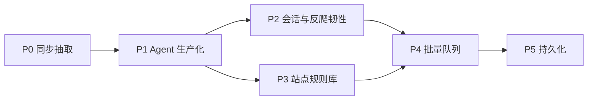

# arachne 设计文档

> 版本：v0.1 · 受众：维护者与调用方（AI Agent 系统）  
> 仓库：https://github.com/Ever12349/arachne  
> 本地：`/Users/qianxiao/worker/AIAgent/arachne`

## 1. 定位

arachne 是一个 **Python HTTP 爬虫/抽取服务**：接收 URL（及后续可选的会话与策略参数），返回 **结构化、对 LLM/Agent 友好的 JSON**，而不是原始 HTML dump。

**主调用方**：AI Agent 系统（工具调用 / Function calling）。设计优先保证：

- 契约稳定、字段语义清晰
- 错误可机读（`error.code`）
- 延迟与体量可控（超时、响应上限、链接封顶）
- 可在 Agent 工作流里同步调用（P0），后续支持异步任务（批量队列）

**非定位**：通用浏览器自动化 IDE、恶意爬虫框架、认证攻击工具。

## 2. 目标与边界

### 2.1 要做的事

| 能力 | 说明 |
|------|------|
| URL → 结构化页 | title、main_text、metadata、links |
| 稳定 HTTP API | FastAPI，供 Agent 工具层调用 |
| 可演进 | 会话、反爬韧性、站点规则、批量、持久化按路线图推进 |

### 2.2 安全与合规边界（硬约束）

- **不做**凭证窃取、撞库、验证码农场、漏洞利用类「认证绕过」
- **登录态**：仅支持 **调用方显式注入** 其有权使用的 Cookie / Authorization Header（Agent 代表用户完成授权后传入），服务端不代为破解登录墙
- **robots / 站点条款**：实现阶段遵守可配置策略；默认尊重合理速率与体积极限
- 不存储调用方传入的密钥明文到日志；持久化阶段对会话材料加密或外置密钥管理

「以后需要的登录态 / 反爬 / 规则库 / 队列 / 存储」见 §6 路线图；其中原「认证绕过」诉求落地为 **受控会话注入 + 合法授权访问**，不实现攻击型绕过。

## 3. API 契约（面向 Agent）

### 3.1 端点（P0）

| 方法 | 路径 | 作用 |
|------|------|------|
| `GET` | `/health` | 探活 |
| `GET` | `/extract?url=` | 同步抽取 |
| `POST` | `/extract` | 同步抽取（JSON body，便于 Agent 扩展字段） |

后续（见路线图）可增加例如：

- `POST /jobs` / `GET /jobs/{id}` — 批量与异步
- `POST /extract` 扩展字段：`cookies`、`headers`、`site_profile`、`render` 等

### 3.2 成功响应（P0 定稿）

`links` 使用对象列表（对 Agent 更友好，可区分锚文本与 URL）：

```json
{
  "url": "https://example.com/final",
  "requested_url": "https://example.com",
  "status_code": 200,
  "title": "Example Domain",
  "main_text": "…可读正文…",
  "metadata": {
    "description": "…",
    "language": "en",
    "content_type": "text/html; charset=utf-8",
    "og": {
      "title": "…",
      "description": "…",
      "image": "…"
    }
  },
  "links": [
    {"href": "https://example.com/a", "text": "A"}
  ]
}
```

相对当前 stub 的变更：

- 增加 `requested_url`、`status_code`
- `links`: `string[]` → `{href, text}[]`（实现业务前改 models）

### 3.3 错误响应（机读）

HTTP 状态与业务码分离；body 统一：

```json
{
  "error": {
    "code": "bad_url | fetch_failed | timeout | unsupported_content | too_large | rate_limited | unauthorized_upstream | internal",
    "message": "人类可读短句",
    "detail": {}
  }
}
```

Agent 应根据 `error.code` 分支（重试 / 换策略 / 向用户要 Cookie），而不是解析 `message` 字符串。

### 3.4 调用约定（给 Agent 集成）

- 优先 `POST /extract`，便于后续加 `cookies` / `headers` 而不改 URL 长度限制
- 设置客户端超时略大于服务端读超时（建议服务端读 15s，Agent 侧 ≥ 20s）
- 把 `main_text` 当作模型上下文的主输入；`metadata` / `links` 按需使用，避免整页塞进 prompt
- 对同一 URL 的重复调用：P1+ 可走缓存；P0 Agent 侧自行去重

## 4. 架构

### 4.1 P0 同步流水线

```
Agent → FastAPI /extract
          → validate(url)
          → fetch(httpx)
          → extract(html → fields)
          → ExtractResponse JSON
```

### 4.2 模块划分

```
app/
  main.py       # 路由、依赖注入、错误映射
  models.py     # Pydantic 请求/响应/Error
  config.py     # 超时、UA、体积上限、并发上限
  fetch.py      # httpx 异步拉取
  extract.py    # HTML → title/main_text/metadata/links
```

后续扩展（不堵死）：

```
app/
  session.py      # Cookie/Header 合并与校验
  antibot.py      # 退避、指纹/UA 池、可选 render 适配
  profiles/       # 站点专用规则
  jobs/           # 队列与任务状态
  store/          # 结果与任务持久化
```

### 4.3 技术选型（P0）

| 层 | 选择 | 理由 |
|----|------|------|
| API | FastAPI + uvicorn | 异步、OpenAPI、适合工具调用 |
| 拉取 | httpx（async） | 超时/重定向清晰 |
| 抽取 | trafilatura（首选） | 正文质量好、依赖相对可控 |
| 渲染 | 不做（P0） | Playwright 放到 P2+ 可选 `render` |

依赖保持薄；每加一个库要能说明它服务哪条流水线步骤。

### 4.4 运行参数（建议默认）

- 仅允许 `http` / `https`
- 连接超时 5s，读超时 15s
- 响应体上限约 2MB
- 链接最多约 50（同域优先、去重、相对转绝对）
- 固定且可配置的 User-Agent
- 单进程并发上限（P1：信号量），防止 Agent 风暴打满出口

## 5. 实现分期（开发计划）

### P0 — 可用同步抽取（当前下一步实现）

- [ ] 落地 `models`（含 `links: [{href, text}]`）
- [ ] `fetch`：httpx、超时、体积、Content-Type 检查
- [ ] `extract`：title / main_text / metadata / links
- [ ] 错误码与 OpenAPI 示例
- [ ] 用公开样例 URL 实测；README 更新 curl 与 Agent 调用说明
- [ ] **不含** Cookie、队列、DB、Playwright

### P1 — Agent 生产可用性

- [ ] 请求侧可选 `headers` / `cookies`（调用方注入会话）
- [ ] 基础速率限制与并发上限
- [ ] 短 TTL 结果缓存（同 URL + 会话指纹）
- [ ] 更稳的链接筛选与正文截断策略（给 LLM 的 `max_chars`）
- [ ] 结构化日志（无密钥）、基础指标（延迟、错误码分布）

### P2 — 登录态与反爬韧性

- [ ] **受控登录态**：文档化 Cookie/Header 注入约定；可选「会话配置」引用（存加密 store，不进 prompt）
- [ ] **反爬对抗（防御性）**：可配置重试/退避、UA 策略、挑战页识别（返回明确 `error.code`，由 Agent 决定是否换策略或人工）
- [ ] 可选 `render=true`（Playwright）走独立依赖路径，默认关闭
- [ ] **不做**：验证码破解服务、自动撞登录、漏洞利用

### P3 — 站点专用规则库

- [ ] `site_profile`：按 host 的选择器 / 字段映射 / 禁用规则
- [ ] 规则热更新（文件或 DB）；未知站点回退通用抽取
- [ ] 规则版本号进入响应，便于 Agent 调试

### P4 — 批量队列

- [ ] `POST /jobs` 提交 URL 列表；`GET /jobs/{id}` 查状态与结果
- [ ] 队列后端（如 Redis / 本地 asyncio 队列起步）
- [ ] Agent 回调或轮询约定；单任务内并发与全局配额

### P5 — 持久化存储

- [ ] 任务与抽取结果存储（PostgreSQL 或同等）
- [ ] 会话材料加密存放；保留期限与清理策略
- [ ] 按 `job_id` / URL / Agent 租户查询 API

## 6. 路线图总览



与用户后续需求的对应关系：

| 用户提到的能力 | 落点 | 说明 |
|----------------|------|------|
| 登录态 / Cookie 抓取 | P2（会话注入） | 调用方授权后注入；非服务端代登破解 |
| 反爬对抗 | P2 | 韧性与可观测，非攻击工具 |
| 站点专用规则库 | P3 | |
| 批量队列 | P4 | |
| 持久化存储 | P5 | |
| 「认证绕过」 | **不实现攻击型绕过** | 以受控会话 + 明确错误码替代 |

## 7. 与当前仓库状态

- 已有 FastAPI stub：`GET/POST /extract` 返回空字段占位
- 业务逻辑未实现；以本文为实施依据
- 实现 P0 前先改 `ExtractResponse.links` 为对象列表，并更新 README / OpenAPI

## 8. 验收（P0）

1. `uvicorn app.main:app` 可启动  
2. 对公开 HTML 页请求 `/extract`，`title` 与 `main_text` 非空  
3. 非法 URL / 超时 / 非 HTML 返回约定 `error.code`  
4. README 含 Agent 侧最小调用示例（`curl` + 字段说明）

---

文档变更随实现迭代；重大契约变更需升版本号并通知 Agent 集成方。
