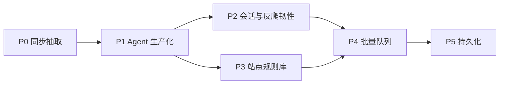

# arachne 设计文档

> 版本：v0.2.0 · 受众：维护者与调用方（AI Agent 系统）  
> 仓库：https://github.com/Ever12349/arachne  
> 状态：P1 Agent 生产可用性已落地（会话注入、QPS/并发、TTL 缓存、`max_chars`、`/stats`；无 Playwright / Redis / 队列 / DB）

## 1. 定位

arachne 是一个 **Python HTTP 爬虫/抽取服务**：接收 URL（及后续可选的会话与策略参数），返回 **结构化、对 LLM/Agent 友好的 JSON**，而不是原始 HTML dump。

**主调用方**：AI Agent 系统（工具调用 / Function calling）。设计优先保证：

- 契约稳定、字段语义清晰
- 错误可机读（`error.code`）
- 延迟与体量可控（超时、响应上限、链接封顶、QPS/并发、缓存）
- 可在 Agent 工作流里同步调用（P0/P1），后续支持异步任务（批量队列）

**非定位**：通用浏览器自动化 IDE、恶意爬虫框架、认证攻击工具。

## 2. 目标与边界

### 2.1 要做的事

| 能力 | 说明 |
|------|------|
| URL → 结构化页 | title、main_text、metadata、links、truncated |
| 稳定 HTTP API | FastAPI，供 Agent 工具层调用 |
| 生产可用性（P1） | POST 会话、速率/并发、短 TTL 缓存、`max_chars`、结构化日志与 `/stats` |
| 可演进 | 反爬韧性、站点规则、批量、持久化按路线图推进 |

### 2.2 安全与合规边界（硬约束）

- **不做**凭证窃取、撞库、验证码农场、漏洞利用类「认证绕过」
- **登录态**：仅支持 **调用方显式注入** 其有权使用的 Cookie / Authorization Header（Agent 代表用户完成授权后传入），服务端不代为破解登录墙。P1 仅 POST `/extract` 接受 `cookies` / `headers`
- **robots / 站点条款**：实现阶段遵守可配置策略；默认尊重合理速率与体积极限
- 不把 Cookie / Authorization / cookies 值写入日志（会话指纹 sha256 前缀可以）

「以后需要的登录态 / 反爬 / 规则库 / 队列 / 存储」见 §6 路线图；其中原「认证绕过」诉求落地为 **受控会话注入 + 合法授权访问**，不实现攻击型绕过。

## 3. API 契约（面向 Agent）

契约版本 **0.2.0**。

### 3.1 端点（P1）

| 方法 | 路径 | 作用 |
|------|------|------|
| `GET` | `/health` | 探活（**免** QPS 与抽取并发） |
| `GET` | `/stats` | 进程内计数器（**免** QPS 与抽取并发） |
| `GET` | `/extract?url=&max_chars=` | 同步抽取；可选 `max_chars`。**无** cookies/headers |
| `POST` | `/extract` | 同步抽取；JSON：`url`，可选 `headers`、`cookies`（均为 `dict[str,str]`）、`max_chars` |

后续（见路线图）可增加例如：

- `POST /jobs` / `GET /jobs/{id}` — 批量与异步
- `POST /extract` 扩展字段：`site_profile`、`render` 等

GET 会话、成功响应上的 `cached` 字段、错误结果缓存：**不做**（P1 明确排除）。

### 3.2 成功响应

`links` 使用对象列表。`url` 为重定向后的最终地址；`requested_url` 为调用方原始 URL。metadata 字符串字段缺省为 `""`。`truncated` 默认 `false`：仅在 `main_text` 因 `max_chars` 或硬上限被截断时为 `true`。成功体 **没有** `cached` 字段；命中只计入日志与 `/stats`。

```json
{
  "url": "https://example.com/final",
  "requested_url": "https://example.com",
  "status_code": 200,
  "title": "Example Domain",
  "main_text": "…可读正文…",
  "metadata": {
    "description": "…",
    "language": "en",
    "content_type": "text/html; charset=utf-8",
    "og": {
      "title": "…",
      "description": "…",
      "image": "…"
    }
  },
  "links": [
    {"href": "https://example.com/a", "text": "A"}
  ],
  "truncated": false
}
```

正文由 trafilatura 从已下载 HTML 抽取；若 `title` 与 `main_text` 均为空 → `extract_empty`。

`max_chars` / 硬上限（在缓存写入**之后**应用）：

- 省略 `max_chars`：只应用 `MAIN_TEXT_MAX_CHARS=100_000`；若被硬截断则 `truncated=true`
- 提供 `max_chars`：先夹到 `[1, MAIN_TEXT_MAX_CHARS]`，再截断；发生截断则 `truncated=true`

链接：全页 lxml `<a>`；跳过空 href、裸 `#` fragment、`javascript:` / `mailto:` / `tel:`、非 `http(s)`；锚文本上限 `LINK_TEXT_MAX_CHARS=200`；最多 50 条；同 host 优先（比较 host 时去掉前导 `www.`）。

### 3.3 错误响应（机读）

HTTP 状态与业务码分离；body 统一：

```json
{
  "error": {
    "code": "bad_url | fetch_failed | timeout | unsupported_content | too_large | unauthorized_upstream | extract_empty | rate_limited | internal",
    "message": "人类可读短句",
    "detail": {}
  }
}
```

错误码 → HTTP：

| code | HTTP |
|------|------|
| `bad_url` | 400 |
| `unsupported_content` / `extract_empty` / `too_large` | 422 |
| `rate_limited` | 429 |
| `timeout` | 504 |
| `fetch_failed` / `unauthorized_upstream` | 502 |
| `internal` | 500 |

上游 `status >= 400` **不抽取**：401/403 → `unauthorized_upstream`，其余 → `fetch_failed`；`detail` 含 `status_code`。

Agent 应根据 `error.code` 分支（重试 / 换策略 / 向用户要 Cookie），而不是解析 `message` 字符串。

### 3.4 会话（仅 POST）

- `cookies`：`dict[str, str]` → httpx 请求 cookies
- `headers`：仅允许 `Authorization`、`Accept`、`Accept-Language`、`User-Agent`、`Referer`、`Cache-Control`（大小写不敏感，转发时用规范名）
- 拒绝/剥离：`Host`、`Content-Length`、`Transfer-Encoding`、`Connection`、`Cookie`（Cookie **只能**走 `cookies` 字段）
- 调用方 `User-Agent` 覆盖默认 `ARACHNE_USER_AGENT`
- GET `/extract` 不接受 cookies/headers

### 3.5 `/stats`

```json
{
  "requests_total": 0,
  "errors_by_code": {},
  "cache_hits": 0,
  "cache_misses": 0,
  "in_flight": 0,
  "latency_ms_sum": 0.0,
  "latency_ms_count": 0
}
```

计数只覆盖抽取流水线（含 `rate_limited`）。`/health` 与 `/stats` 自身不计入。

### 3.6 调用约定（给 Agent 集成）

- 需要会话时必须 `POST /extract`；GET 只有 `url` + 可选 `max_chars`
- 设置客户端超时略大于服务端读超时（建议服务端读 15s，Agent 侧 ≥ 20s）
- 把 `main_text` 当作模型上下文的主输入；用 `max_chars` 控制 prompt 体积
- 同一 URL + 同一会话指纹 60s 内命中进程内缓存（不表示响应里有 `cached` 字段）
- 全局限流：固定 1 秒窗口 QPS=5（可环境变量覆盖）；超出 → `rate_limited` / 429

## 4. 架构

### 4.1 P1 同步流水线

```
Agent → FastAPI /extract
          → QPS（全局固定 1s 窗口）
          → cache lookup（规范化 URL + 会话指纹）
          → (miss) asyncio.Semaphore → fetch(httpx) → extract
          → store cache（仅成功 ExtractResponse）
          → apply max_chars / 硬上限 + truncated
          → ExtractResponse JSON
```

`/health` 与 `/stats` 不经过 QPS 与抽取信号量。

### 4.2 模块划分

```
app/
  main.py            # 路由、lifespan、错误映射
  models.py          # Pydantic 请求/响应/Error/Stats
  config.py          # 超时、UA、体积、并发、QPS、缓存 TTL
  errors.py          # ArachneError 与 HTTP 映射
  ssrf.py            # getaddrinfo + 非公网地址拒绝
  fetch.py           # httpx 异步拉取（可选 headers/cookies）
  extract.py         # HTML → 字段；apply_max_chars
  headers_policy.py  # 请求头允许名单
  cache.py           # URL 规范化、会话指纹、TTLCache
  limits.py          # 固定窗口 QPS、信号量、Stats
  logging_setup.py   # 结构化日志（无密钥）
  service.py         # QPS → cache → fetch/extract → 截断
```

后续扩展（不堵死）：

```
app/
  antibot.py      # 退避、指纹/UA 池、可选 render 适配
  profiles/       # 站点专用规则
  jobs/           # 队列与任务状态
  store/          # 结果与任务持久化
```

### 4.3 技术选型

| 层 | 选择 | 理由 |
|----|------|------|
| API | FastAPI + uvicorn | 异步、OpenAPI、适合工具调用 |
| 拉取 | httpx（async） | 超时/重定向清晰 |
| 抽取 | trafilatura（首选） | 正文质量好、依赖相对可控 |
| 缓存 | cachetools.TTLCache | 进程内短 TTL；`requirements.txt` 用 `==` 钉死 |
| 渲染 | 不做（P1） | Playwright 放到 P2+ 可选 `render` |

依赖保持薄；每加一个库要能说明它服务哪条流水线步骤。

### 4.4 运行参数

- 仅允许 `http` / `https`
- `httpx.Timeout(connect=5, read=15, write=15, pool=5)`（httpx 要求四项都给；connect/read 为锁定值）
- 响应体上限 2MB（`Content-Length` 超限或实际读取超限 → `too_large`）
- `main_text` 硬上限 `MAIN_TEXT_MAX_CHARS=100_000`（缓存之后应用）
- 链接最多 50；锚文本 `LINK_TEXT_MAX_CHARS=200`
- User-Agent：`ARACHNE_USER_AGENT`；POST 调用方可覆盖
- 共享 `httpx.AsyncClient`（FastAPI lifespan）
- 全局固定窗口 QPS=5（`ARACHNE_QPS`）；抽取并发 `asyncio.Semaphore(10)`（`ARACHNE_MAX_CONCURRENCY`），仅 cache miss
- 缓存：`TTLCache` TTL=60s、maxsize=256（`ARACHNE_CACHE_TTL_SECONDS`、`ARACHNE_CACHE_MAXSIZE`）
- 缓存键：规范化 URL（scheme/host 小写、去掉默认端口与 fragment、**保留 query 原顺序**）+ 会话指纹（canonical JSON 再 sha256）
- 只缓存成功 `ExtractResponse`，不缓存错误

### 4.5 SSRF（P0，仍有效）

流程：解析 URL → `getaddrinfo` → 若任一地址为 private / loopback / link-local / unspecified（含 IPv4-mapped IPv6）则 `bad_url` → **仍用原始 hostname 发请求**（不改连解析到的 IP，以免 TLS 证书与虚拟主机失败）。

每次跳转前同样做该校验（httpx `request` hook）。

**残留风险（DNS rebinding）**：校验与 TCP/TLS 连接之间，DNS 可能被换成内网地址。P0 接受该窗口并在此记录；按解析 IP 直连或连接后核对对端地址属于后续加固。

### 4.6 可观测性

抽取日志字段：`latency_ms`、`error_code`、`cache`（hit/miss）、`session`（指纹前缀）、`url`。禁止记录 Cookie / Authorization / cookies 值。

## 5. 实现分期（开发计划）

### P0 — 可用同步抽取（已实现）

- [x] 落地 `models`（含 `links: [{href, text}]`）
- [x] `fetch`：httpx、超时、体积、Content-Type 检查
- [x] `extract`：trafilatura 抽 title / main_text；lxml 抽 links；metadata 含 description / language / content_type / og
- [x] 错误码与 HTTP 映射（含 `extract_empty`）
- [x] 用公开样例 URL 实测；README 更新 curl 与 Agent 调用说明
- [x] 单元测试（mock）+ 可选 `@pytest.mark.integration` 活测
- [x] **不含** Cookie、队列、DB、Playwright（会话在 P1）

### P1 — Agent 生产可用性（已实现）

- [x] 请求侧可选 `headers` / `cookies`（POST only；允许名单；Cookie 不走 headers）
- [x] 基础速率限制（固定 1s 窗口 QPS=5）与并发上限（cache miss 上 Semaphore(10)）
- [x] 短 TTL 结果缓存（规范化 URL + 会话指纹；只缓存成功）
- [x] 链接筛选（跳过 `#` / `tel:` / 非 http(s)）与 `max_chars` / 硬上限 + `truncated`
- [x] 结构化日志（无密钥）、`GET /stats`
- [x] **不含** Playwright、站点规则、Redis/队列/DB、GET 会话、缓存错误、成功体 `cached` 字段

### P2 — 登录态与反爬韧性

- [ ] **受控登录态**：文档化 Cookie/Header 注入约定；可选「会话配置」引用（存加密 store，不进 prompt）
- [ ] **反爬对抗（防御性）**：可配置重试/退避、UA 策略、挑战页识别（返回明确 `error.code`，由 Agent 决定是否换策略或人工）
- [ ] 可选 `render=true`（Playwright）走独立依赖路径，默认关闭
- [ ] **不做**：验证码破解服务、自动撞登录、漏洞利用

### P3 — 站点专用规则库

- [ ] `site_profile`：按 host 的选择器 / 字段映射 / 禁用规则
- [ ] 规则热更新（文件或 DB）；未知站点回退通用抽取
- [ ] 规则版本号进入响应，便于 Agent 调试

### P4 — 批量队列

- [ ] `POST /jobs` 提交 URL 列表；`GET /jobs/{id}` 查状态与结果
- [ ] 队列后端（如 Redis / 本地 asyncio 队列起步）
- [ ] Agent 回调或轮询约定；单任务内并发与全局配额

### P5 — 持久化存储

- [ ] 任务与抽取结果存储（PostgreSQL 或同等）
- [ ] 会话材料加密存放；保留期限与清理策略
- [ ] 按 `job_id` / URL / Agent 租户查询 API

## 6. 路线图总览



与用户后续需求的对应关系：

| 用户提到的能力 | 落点 | 说明 |
|----------------|------|------|
| 登录态 / Cookie 抓取 | P1 注入 + P2 会话配置 | 调用方授权后注入；非服务端代登破解 |
| 反爬对抗 | P2 | 韧性与可观测，非攻击工具 |
| 站点专用规则库 | P3 | |
| 批量队列 | P4 | |
| 持久化存储 | P5 | |
| 「认证绕过」 | **不实现攻击型绕过** | 以受控会话 + 明确错误码替代 |

## 7. 与当前仓库状态

- P1 已实现：`GET/POST /extract` 对公开 HTML URL 返回非空 `title` / `main_text`（受上游与抽取质量约束）；POST 可带会话；`truncated` / `/stats` / `rate_limited`
- 运行时依赖钉死在 `requirements.txt`（`==`，含 `cachetools`）；测试见 `requirements-dev.txt`
- 单元测试默认不访问网络；活测：`ARACHNE_INTEGRATION=1 pytest -m integration`

## 8. 验收（P1）

1. `uvicorn app.main:app` 可启动  
2. 对公开 HTML 页请求 `/extract`，`title` 与 `main_text` 非空，含 `truncated`  
3. 非法 URL / 超时 / 非 HTML / 空抽取 / 超体积 / 超 QPS 返回约定 `error.code`（含 `rate_limited` → 429）  
4. POST `cookies` 进入上游请求；禁止头被剥离；GET 无会话字段  
5. `GET /stats` 返回约定计数器；cache hit 不触发二次上游拉取  
6. README 含 Agent 侧调用示例（`curl`、会话、`max_chars`、stats）  
7. `pytest -m "not integration"` 通过

---

文档变更随实现迭代；重大契约变更需升版本号并通知 Agent 集成方。
